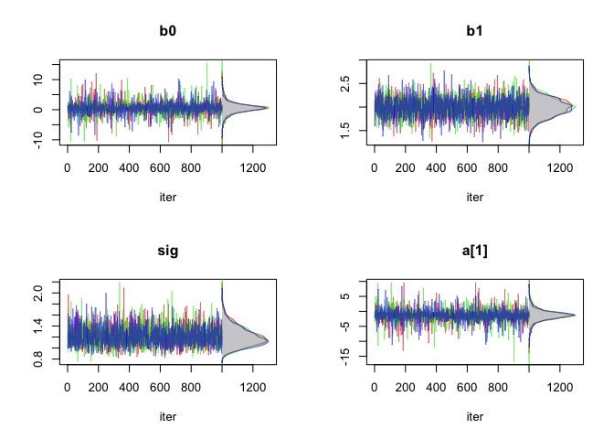
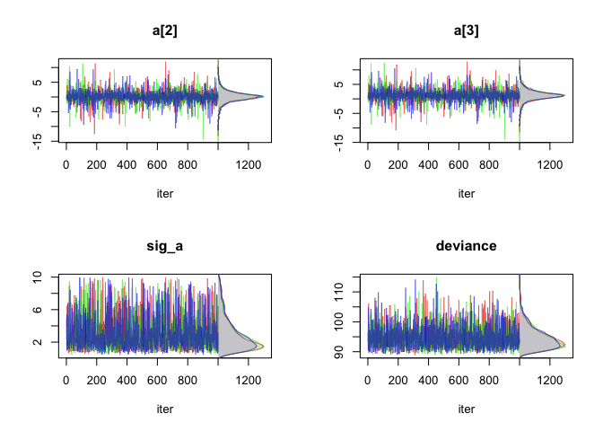
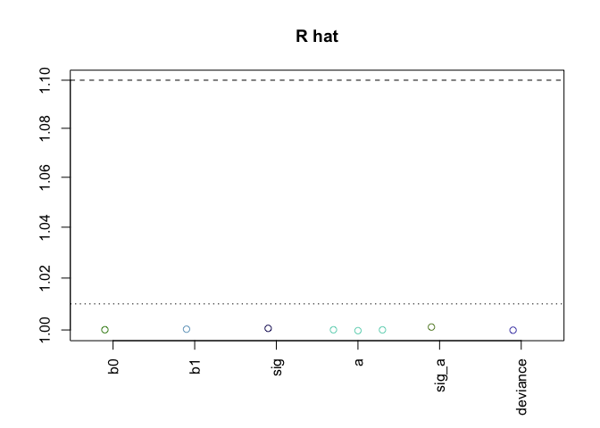
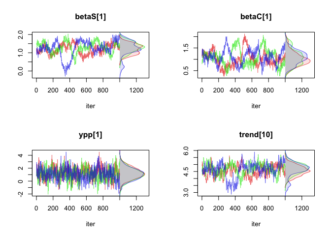
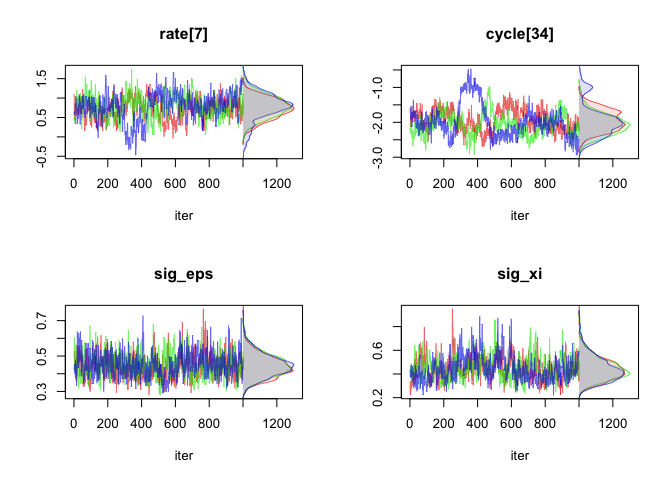
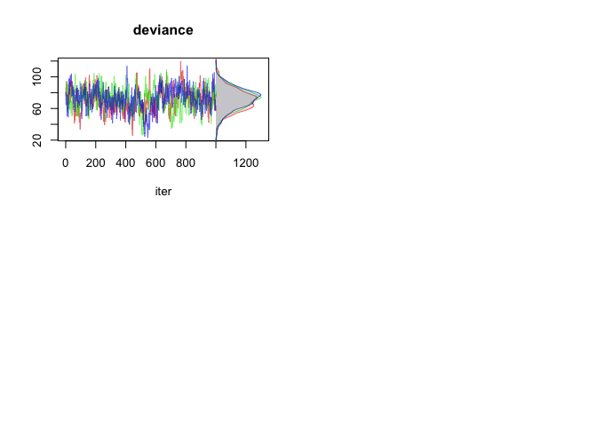
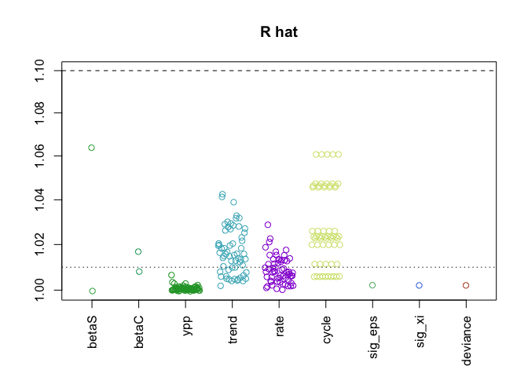
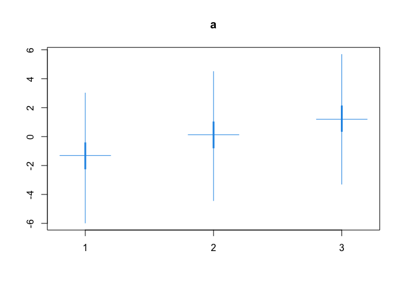
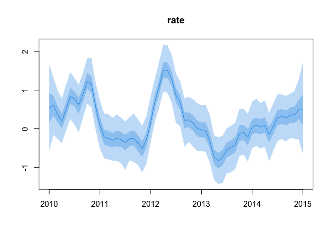

<!-- README.md is generated from README.Rmd. Please edit that file -->

# jagshelper

<!-- badges: start -->
<!-- badges: end -->

The goal of jagshelper is to streamline Bayesian analysis in JAGS using
the `jagsUI` package.  
Functions are provided for extracting output in a simpler form,
assessing model convergence, and plotting model output. Also included is
a function giving a template model in JAGS syntax with the associated
`jagsUI` code.

## Installation

You can install the development version of jagshelper like so:

``` r
devtools::install_github("mbtyers/jagshelper")
```

## Model template

The `skeleton()` function prints a JAGS model template to the screen,
along with an associated simulated dataset.

``` r
library(jagshelper)
skeleton("EXAMPLE")
#> 
#> library(jagsUI)
#> 
#> # specify model, which is written to an external file
#> cat('model {
#>   for(i in 1:n) {
#>     y[i] ~ dnorm(mu[i], tau)
#>     mu[i] <- b0 + b1*x[i] + a[grp[i]]
#>   }
#> 
#>   for(j in 1:ngrp) {
#>     a[j] ~ dnorm(0, tau_a)
#>   }
#> 
#>   tau <- pow(sig, -2)
#>   sig ~ dunif(0, 10)
#>   b0 ~ dnorm(0, 0.001)
#>   b1 ~ dnorm(0, 0.001)
#> 
#>   tau_a <- pow(sig_a, -2)
#>   sig_a ~ dunif(0, 10)
#> }', file="EXAMPLE_jags")
#> 
#> 
#> # simulate data to go with the example model
#> n <- 60
#> x <- rnorm(n, sd=3)
#> grp <- sample(1:3, n, replace=T)
#> y <- rnorm(n, mean=grp-x)
#> 
#> # bundle data to pass into JAGS
#> EXAMPLE_data <- list(x=x,
#>                  y=y,
#>                  n=length(x),
#>                  grp=as.numeric(as.factor(grp)),
#>                  ngrp=length(unique(grp)))
#> 
#> # JAGS controls
#> niter <- 10000
#> ncores <- 3
#> 
#> {
#>   tstart <- Sys.time()
#>   print(tstart)
#>   EXAMPLE_jags_out <- jagsUI::jags(model.file="EXAMPLE_jags", data=EXAMPLE_data,
#>                              parameters.to.save=c("b0","b1","sig","a","sig_a"),
#>                              n.chains=ncores, parallel=T, n.iter=niter,
#>                              n.burnin=niter/2, n.thin=niter/2000)
#>   print(Sys.time() - tstart)
#> }
```

## Assessing convergence - a simple model

In the example below, there are relatively few parameters saved, and it
is feasible to examine the trace plots associated with each parameter.

``` r
nparam(asdf_jags_out)  # how many parameters in total
#> [1] 8
nbyname(asdf_jags_out)  # how many parameters (or dimensions) per parameter name
#> $b0
#> [1] 1
#> 
#> $b1
#> [1] 1
#> 
#> $sig
#> [1] 1
#> 
#> $a
#> [1] 3
#> 
#> $sig_a
#> [1] 1
#> 
#> $deviance
#> [1] 1
tracedens_jags(asdf_jags_out, parmfrow=c(2,2))  #trace plots
```



``` r
check_Rhat(asdf_jags_out)  # proportion of Rhats below a threshold of 1.1
#>       b0       b1      sig        a    sig_a deviance 
#>        1        1        1        1        1        1
plotRhats(asdf_jags_out)  # plotting Rhat values
```



## Assessing convergence - a more complex model

In the example below, there are relatively many parameters saved, and it
is perhaps more illustrative to examine the trace plots associated with
the least- converged parameters, as measured by `Rhat` value.

``` r
nparam(SS_jags)  # how many parameters in total
#> [1] 251
nbyname(SS_jags)  # how many parameters (or dimensions) per parameter name
#> $betaS
#> [1] 2
#> 
#> $betaC
#> [1] 2
#> 
#> $ypp
#> [1] 61
#> 
#> $trend
#> [1] 61
#> 
#> $rate
#> [1] 61
#> 
#> $cycle
#> [1] 61
#> 
#> $sig_eps
#> [1] 1
#> 
#> $sig_xi
#> [1] 1
#> 
#> $deviance
#> [1] 1
traceworstRhat(SS_jags, parmfrow=c(2,2))  #trace plots
```



``` r
check_Rhat(SS_jags)  # proportion of Rhats below a threshold of 1.1
#>    betaS    betaC      ypp    trend     rate    cycle  sig_eps   sig_xi 
#>        1        1        1        1        1        1        1        1 
#> deviance 
#>        1
plotRhats(SS_jags)  # plotting Rhat values
```



## Extracting output as data.frame

The `jags_df()` function extracts the full posterior from an output
object returned by `jagsUI::jags()` as a `data.frame`, which may be
preferable for some users.

``` r
out_df <- jags_df(asdf_jags_out)
str(out_df)
#> 'data.frame':    3000 obs. of  8 variables:
#>  $ b0      : num  2.3277 2.0525 0.7498 -3.6158 -0.0143 ...
#>  $ b1      : num  1.89 2.15 1.74 1.94 2.01 ...
#>  $ sig     : num  1.24 1.19 1.1 1.23 1.97 ...
#>  $ a[1]    : num  -3.26 -2.79 -1.86 2.63 -1.5 ...
#>  $ a[2]    : num  -1.365 -0.502 -0.361 4.024 0.693 ...
#>  $ a[3]    : num  -0.66 -0.399 1.144 5.355 2.017 ...
#>  $ sig_a   : num  1.66 1.74 2.07 6.46 3.9 ...
#>  $ deviance: num  90.9 94.3 91.6 90.3 106 ...
```

## Visualizing posteriors of vectors of parameter nodes

The `caterpillar()` and `envelope()` functions plot output for vectors
of parameter nodes, and `comparecat()`, `comparedens()` and
`overlayenvelope()` functions allow comparison between multiple models
or parameter vectors.

``` r
caterpillar(asdf_jags_out,"a")
```



``` r
envelope(SS_jags,"rate", x=xss)
```


